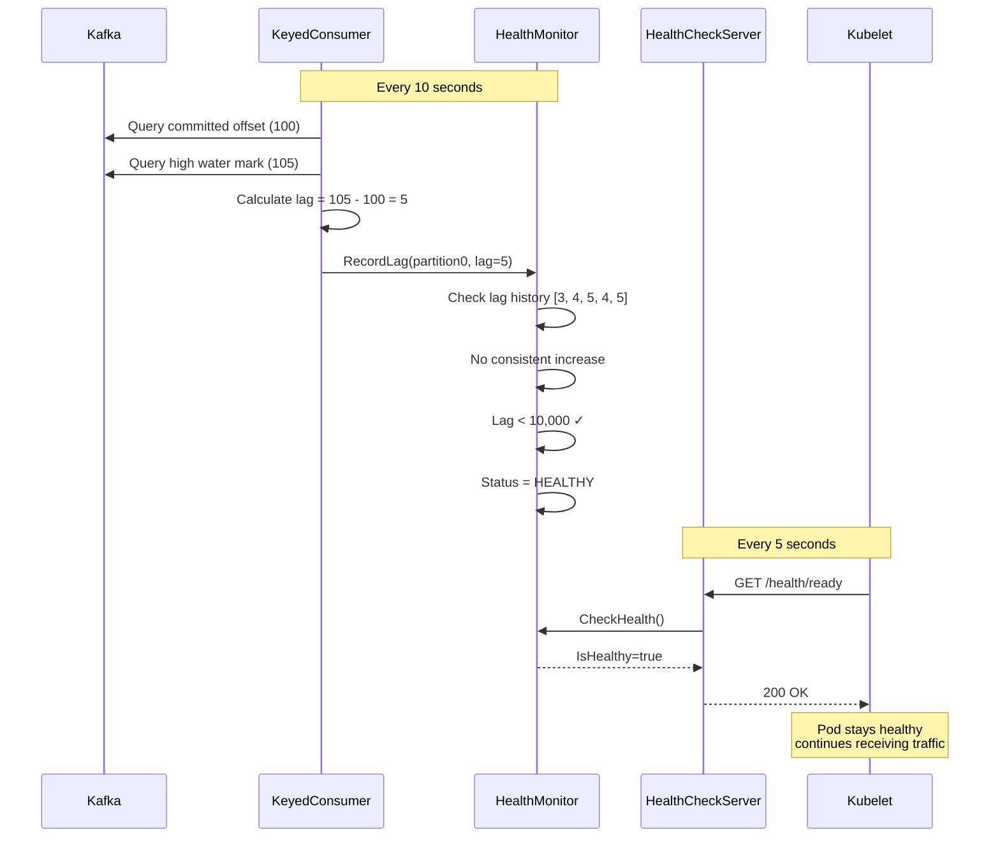
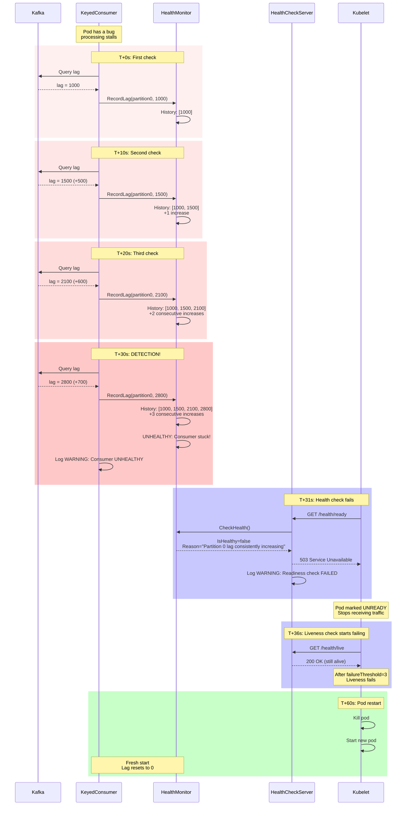
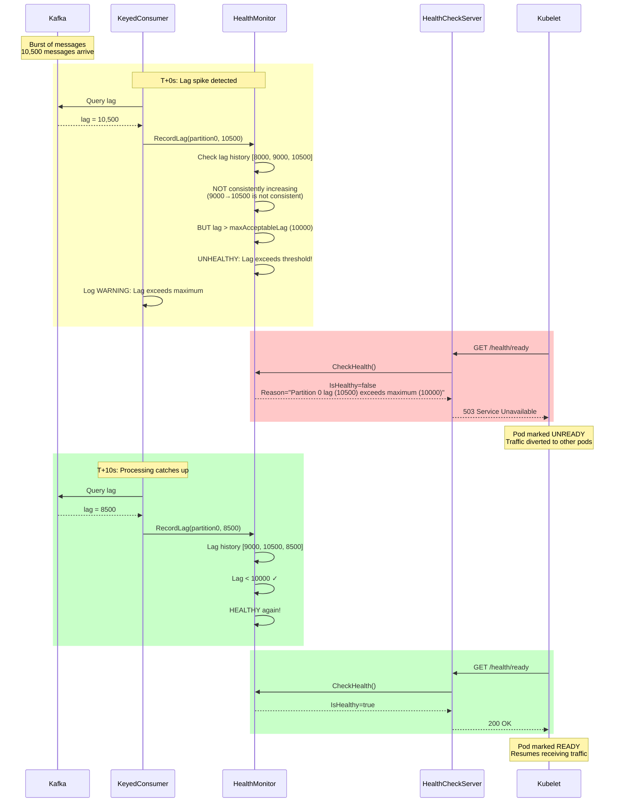
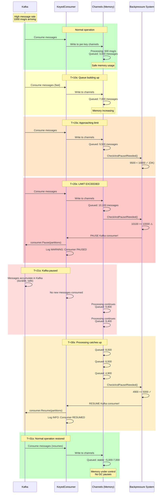
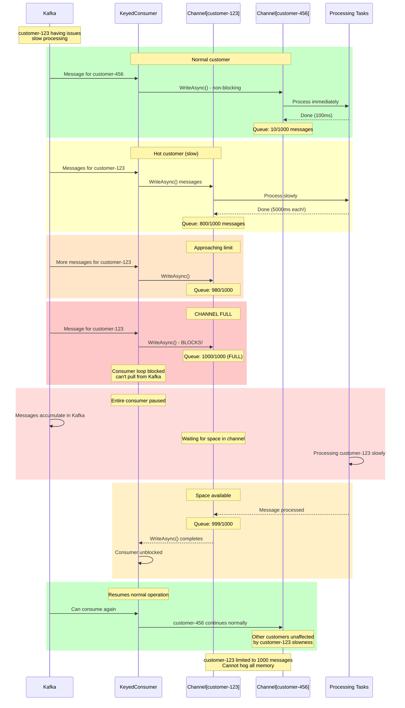

# KOrder Health Monitoring System

## Overview for Non-Technical Readers

Imagine you have a restaurant with multiple kitchens (pods in Kubernetes). Each kitchen receives orders from customers (Kafka messages) and needs to process them in the order they arrive. The Health Monitoring system is like having a manager who constantly watches each kitchen to make sure:

1. **No kitchen gets stuck** - If a kitchen stops processing orders and the queue keeps growing, something is wrong
2. **No kitchen gets overwhelmed** - If orders arrive faster than the kitchen can handle, we need to slow down or get help
3. **Bad kitchens get replaced** - If a kitchen can't recover, we shut it down and start fresh

### How We Handle a Stuck Pod

**The Problem:**
A pod (kitchen) might get stuck due to:
- A bug in the code (chef got confused)
- Database connection issues (freezer door jammed)
- Network problems (phone line cut)

**How We Detect It:**
Every 10 seconds, we check:
- "How many orders are waiting to be processed?" (the lag)
- We keep the last 5 measurements
- If the queue grew 3 times in a row → **Kitchen is stuck!**

**What Happens:**
1. **Health check fails** - We mark the kitchen as unhealthy
2. **Kubernetes stops sending orders** - Readiness probe fails (503 response)
3. **Kubernetes restarts the kitchen** - Liveness probe eventually fails
4. **Fresh start** - New pod starts clean and processes the backlog

### How We Prevent Downstream Flooding

**The Problem:**
If messages arrive at 1000/second but we can only process 500/second, the queue grows forever until we run out of memory.

**Our Solution - Two Layers of Protection:**

#### Layer 1: Per-Key Bounded Channels
- Each customer key has a maximum queue size (1,000 messages)
- When a customer's queue is full, we stop accepting new messages for that customer
- Other customers continue normally

#### Layer 2: Global Pause/Resume
- Total queued messages across all customers: max 10,000
- When we hit 10,000 → **Pause** pulling from Kafka
- Messages stay safe in Kafka (not in memory)
- When queue drops to 5,000 → **Resume** pulling
- This prevents memory exhaustion and GC pauses

**Analogy:**
Think of a highway with two traffic control systems:
1. **Per-lane metering lights** - Each lane can only have so many cars
2. **Global highway closure** - If total traffic exceeds capacity, we temporarily stop letting cars enter

---

## Component Architecture

### 1. ConsumerHealthMonitor

**Purpose:** The "health inspector" that tracks lag patterns and detects problems.

**What It Does:**
- Monitors lag for each Kafka partition assigned to this pod
- Keeps a sliding window of the last 5 lag measurements
- Detects two types of problems:
  - **Stuck consumer:** Lag increasing 3+ times consecutively
  - **High lag:** Lag exceeds threshold (default: 10,000 messages)

**Key Methods:**
```csharp
RecordLag(partition, currentLag)     // Record lag measurement
CheckHealth()                         // Evaluate if consumer is healthy
GetTotalLag()                        // Get total lag across all partitions
```

**Configuration:**
- `lagCheckWindowSize: 5` - Keep last 5 measurements
- `maxAcceptableLag: 10000` - Fail health if lag > 10,000
- `consecutiveIncreaseThreshold: 3` - 3 consecutive increases = stuck

---

### 2. PartitionLagHistory

**Purpose:** Tracks lag history for a single partition to detect patterns.

**What It Does:**
- Maintains a queue of recent lag values (FIFO)
- Analyzes trends: Is lag consistently increasing?
- Counts consecutive increases

**Key Methods:**
```csharp
AddLag(lag)                          // Add new lag measurement
IsConsistentlyIncreasing(threshold)  // Check if stuck (3+ increases)
GetIncreasingCount()                 // Count consecutive increases
```

**Example Detection:**
```
Time  Lag   Status
T0    100   baseline
T1    150   +1 increase
T2    200   +2 increases
T3    280   +3 increases → STUCK!
```

---

### 3. HealthStatus

**Purpose:** Data class representing the current health state.

**Properties:**
```csharp
IsHealthy           // true/false health flag
Reason              // Human-readable explanation
PartitionLags       // Dictionary<partitionId, currentLag>
LastCheckTime       // When was this checked
```

**Used By:**
- HealthCheckServer to determine HTTP response codes
- Logging to report unhealthy states

---

### 4. HealthCheckServer

**Purpose:** HTTP server that exposes health endpoints for Kubernetes probes.

**Endpoints:**

#### `/health/live` (Liveness Probe)
- **Always returns 200 OK** (unless process is completely dead)
- Kubernetes uses this to know if pod needs restart
- Only fails if process is deadlocked or unrecoverable

#### `/health/ready` (Readiness Probe)
- **Returns 200** if consumer is healthy
- **Returns 503** if consumer is stuck or lagging
- Kubernetes uses this to route traffic
- Causes pod to stop receiving new messages when unhealthy

#### `/metrics` (Prometheus)
- Exposes lag metrics in Prometheus format
- Used by monitoring systems (Grafana, etc.)
- Metrics:
  - `kafka_consumer_lag{partition="0"}` - Per-partition lag
  - `kafka_consumer_total_lag` - Total lag
  - `kafka_consumer_healthy` - Health status (1=healthy, 0=unhealthy)

**HTTP Response Codes:**
- `200 OK` - Healthy, ready for traffic
- `503 Service Unavailable` - Unhealthy, don't send traffic

---

### 5. KeyedConsumer Integration

**MonitorLagAsync Task:**
Runs every 10 seconds (configurable) and:

1. **Gets assigned partitions** from Kafka
2. **For each partition:**
   - Query committed offset (where we are)
   - Query high water mark (latest message in Kafka)
   - Calculate lag: `lag = highWaterMark - committedOffset`
   - Record in HealthMonitor
3. **Check health** after all partitions measured
4. **Log warnings** if unhealthy

**Integration Points:**
- `HealthMonitor` property exposed to HealthCheckServer
- Lag monitoring runs as background task
- Automatic cleanup on consumer shutdown

---

## Scenarios with Sequence Diagrams

### Scenario 1: Healthy Pod Processing Messages



---

### Scenario 2: Pod Gets Stuck (Increasing Lag)



---

### Scenario 3: High Lag (Not Stuck, Just Slow)



---

### Scenario 4: Backpressure Prevents Memory Overflow



---

### Scenario 5: Per-Key Bounded Channel Protection



---

## Configuration Reference

### Environment Variables (K8s)

```yaml
env:
  # Kafka Configuration
  - name: KAFKA_BOOTSTRAP_SERVERS
    value: "kafka-service:9092"
  - name: KAFKA_GROUP_ID
    value: "korder-consumer-group"
  - name: KAFKA_TOPIC
    value: "keyed-messages-topic"

  # Health Monitoring
  - name: HEALTH_CHECK_PORT
    value: "8080"
  - name: MAX_ACCEPTABLE_LAG
    value: "10000"            # Fail health if lag > this
  - name: LAG_CHECK_INTERVAL_SECONDS
    value: "10"               # Check lag every N seconds

  # Backpressure
  - name: MAX_QUEUED_MESSAGES
    value: "10000"            # Global pause threshold
  - name: RESUME_THRESHOLD
    value: "5000"             # Global resume threshold
  - name: PER_KEY_CHANNEL_CAPACITY
    value: "1000"             # Max messages per key

  # Logging
  - name: Logging__LogLevel__Default
    value: "Information"      # or Debug, Warning, Error
```

### KeyedConsumer Constructor Parameters

```csharp
new KeyedConsumer(
    bootstrapServers,              // "kafka:9092"
    groupId,                       // Consumer group ID
    topic,                         // Topic name
    logger,                        // ILogger<KeyedConsumer>
    messageProcessor: null,        // Optional custom processor
    maxQueuedMessages: 10000,      // Global pause threshold
    resumeThreshold: 5000,         // Global resume threshold
    perKeyChannelCapacity: 1000,   // Per-key channel limit
    enableHealthMonitoring: true,  // Enable lag monitoring
    maxAcceptableLag: 10000,       // Health check threshold
    lagCheckIntervalSeconds: 10    // Check frequency
);
```

---

## Monitoring Recommendations

### Prometheus Queries

```promql
# High lag alert
kafka_consumer_total_lag > 50000

# Consumer unhealthy
kafka_consumer_healthy == 0

# Pod is frequently pausing (backpressure)
rate(log_messages{message=~".*PAUSED.*"}[5m]) > 0

# Per-partition lag
kafka_consumer_lag{partition="0"}
```

### Grafana Dashboard Panels

1. **Total Consumer Lag** - Line graph of `kafka_consumer_total_lag`
2. **Health Status** - Gauge of `kafka_consumer_healthy` (1=healthy, 0=unhealthy)
3. **Per-Partition Lag** - Multi-line graph with partition breakdown
4. **Backpressure Events** - Log panel filtered for PAUSED/RESUMED
5. **Pod Restarts** - K8s pod restart count

### Log Queries (Loki/CloudWatch)

```logql
# Find unhealthy events
{app="korder-consumer"} |= "UNHEALTHY"

# Track backpressure
{app="korder-consumer"} |= "BACKPRESSURE"

# Dead letter queue entries
{app="korder-consumer"} |= "DEAD LETTER"
```

---

## Troubleshooting Guide

### Symptom: Pod constantly restarting

**Possible Causes:**
- Bug causing consistent failures
- Database connection always failing
- Invalid configuration

**Investigation:**
```bash
# Check previous crash logs
kubectl logs korder-consumer-abc123 --previous

# Check health endpoint manually
kubectl port-forward korder-consumer-abc123 8080:8080
curl http://localhost:8080/health/ready

# Check lag metrics
curl http://localhost:8080/metrics | grep lag
```

---

### Symptom: Lag keeps growing but pod is "healthy"

**Possible Causes:**
- Lag threshold too high (increase from 10,000)
- Messages arriving faster than processing capacity
- Need horizontal scaling

**Solution:**
```yaml
# Lower lag threshold
env:
- name: MAX_ACCEPTABLE_LAG
  value: "5000"  # More sensitive

# Or scale horizontally
spec:
  replicas: 6  # More pods = more parallel processing
```

---

### Symptom: Frequent PAUSED/RESUMED cycles

**Possible Causes:**
- Threshold too aggressive
- Processing bottleneck
- Need performance optimization

**Solution:**
```yaml
# Adjust backpressure thresholds
env:
- name: MAX_QUEUED_MESSAGES
  value: "20000"  # Higher pause threshold
- name: RESUME_THRESHOLD
  value: "10000"  # Higher resume threshold
```

---

## Best Practices

1. **Start Conservative:** Use default thresholds and adjust based on observed behavior
2. **Monitor Prometheus Metrics:** Set up alerts for high lag and unhealthy consumers
3. **Log Aggregation:** Use ELK/Loki to centralize logs for analysis
4. **Load Testing:** Test backpressure behavior under high load before production
5. **Horizontal Scaling:** Add more pods when lag consistently high across all pods
6. **Tune GC:** Use server GC settings for high-throughput scenarios

---

## Summary

The KOrder Health Monitoring system provides **defense in depth** against common Kafka consumer problems:

| Problem | Detection | Response | Outcome |
|---------|-----------|----------|---------|
| Stuck consumer | 3+ consecutive lag increases | Health check fails → Pod restart | Fresh pod processes backlog |
| High lag | Lag > threshold | Health check fails → Load balancing | Traffic distributed to healthy pods |
| Memory overflow | Global queue > 10,000 | Pause Kafka consumption | Messages stay in Kafka (safe) |
| Hot key | Per-key queue full | Block that key's writes | Other keys unaffected |

All of this happens **automatically** with no manual intervention required. Kubernetes orchestrates the healing process based on health check responses.
